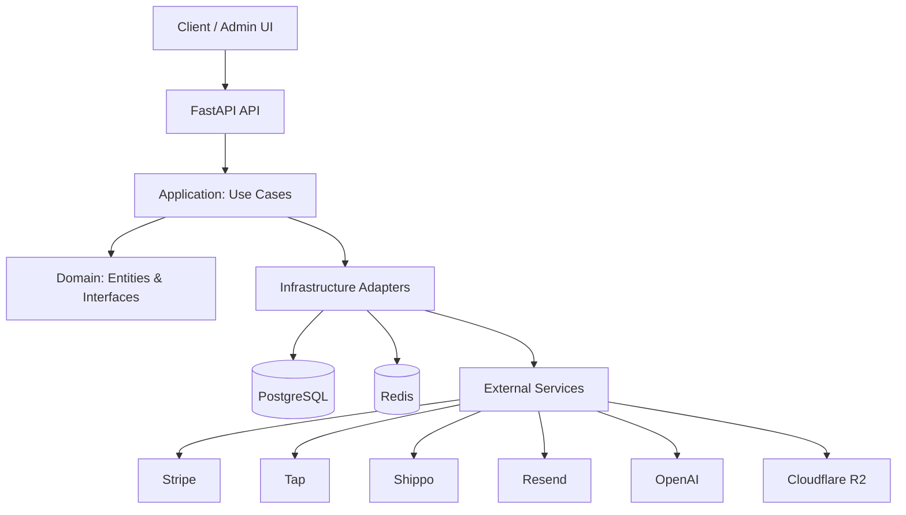
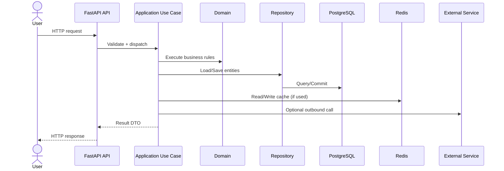

# NUMU Backend

A modern e-commerce platform API built with FastAPI and Clean Architecture.

Quick links:
- System Architecture
- Backend Workflow
- Quick Start
- API Docs
- Configuration
- Project Structure
- Testing

## System Architecture



Layer dependencies:
- `core/` has no dependencies on other layers (pure domain).
- `application/` depends only on `core/`.
- `infrastructure/` implements interfaces from `core/interfaces/`.
- `api/` orchestrates `application/` use cases via dependency injection.

## Backend Workflow

Request lifecycle (interactive sequence diagram):



## Quick Start

Prerequisites:
- Python 3.11+
- PostgreSQL 15+
- Redis 7+

Development setup:
1. Clone and install dependencies:
   ```bash
   git clone <repository-url>
   cd NUMU-api
   pip install -e ".[dev]"
   ```
2. Configure environment:
   ```bash
   cp .env.example .env
   # Edit .env with your configuration
   ```
3. Start services with Docker:
   ```bash
   docker-compose -f docker/docker-compose.yml up -d db redis
   ```
4. Run migrations:
   ```bash
   alembic upgrade head
   ```
5. Seed the database (optional):
   ```bash
   python scripts/seed_data.py
   ```
6. Start the development server:
   ```bash
   uvicorn src.main:app --reload
   ```

Using Docker Compose (full stack):
```bash
docker-compose -f docker/docker-compose.yml up --build
```

## API Docs

Once running, access the interactive API docs:
- Swagger UI: http://localhost:8000/docs
- ReDoc: http://localhost:8000/redoc

## Configuration

Environment variables:

| Variable | Description | Default |
|----------|-------------|---------|
| `DEBUG` | Enable debug mode | `false` |
| `DATABASE_URL` | PostgreSQL connection string | Required |
| `REDIS_URL` | Redis connection string | Required |
| `JWT_PRIVATE_KEY` | RSA private key (PEM) for JWT signing | Required |
| `JWT_PUBLIC_KEY` | RSA public key (PEM) for JWT verification | Required |
| `STRIPE_SECRET_KEY` | Stripe API key | Optional |
| `RESEND_API_KEY` | Resend email API key | Optional |
| `OPENAI_API_KEY` | OpenAI API key | Optional |
| `R2_ACCESS_KEY_ID` | Cloudflare R2 access key | Optional |

See `src/config/settings.py` for all configuration options.

## External Services

| Service | Purpose |
|---------|---------|
| Stripe | Payment processing |
| Tap | Alternative payment gateway |
| Shippo | Shipping and logistics |
| OpenAI | AI-powered features |
| Resend | Email delivery |
| Cloudflare R2 | Object storage |

## Project Structure

<details>
<summary>Show tree</summary>

```text
alembic/                 # Database migrations
docker/                  # Docker configuration
docs/                    # Documentation
scripts/                 # Utility scripts
src/
  api/
    dependencies/        # Dependency injection
    middleware/          # CORS, logging, errors
    responses/           # Response wrappers
    v1/
      routes/            # API endpoints
      schemas/           # Pydantic schemas
  application/
    dto/                 # Data transfer objects
    services/            # Application services
    use_cases/           # Business use cases
  config/                # Settings management
  core/
    entities/            # Domain entities
    exceptions/          # Domain exceptions
    interfaces/          # Repository and service interfaces
    value_objects/       # Immutable value types
  infrastructure/
    cache/               # Redis cache
    database/            # SQLAlchemy setup and models
    external_services/   # Third-party integrations
    messaging/           # Background tasks (Celery)
    repositories/        # Repository implementations
tests/
  e2e/                   # End-to-end tests
  integration/           # Integration tests
  unit/                  # Unit tests
```
</details>

## Testing

```bash
pytest
pytest --cov=src --cov-report=html
pytest tests/unit/
pytest tests/integration/
pytest tests/e2e/
```

## Development Tools

```bash
ruff format src/ tests/
ruff check src/ tests/
mypy src/
```

## License

MIT License
