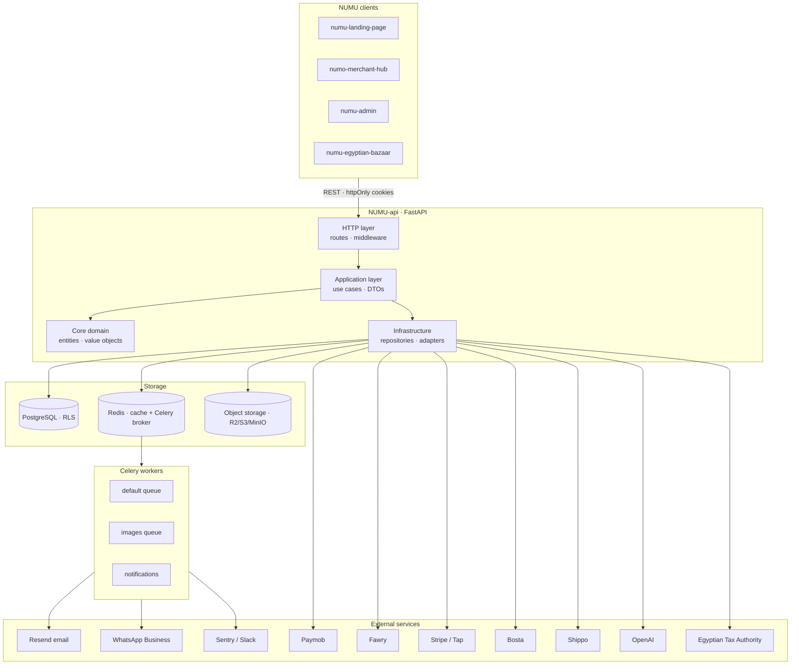
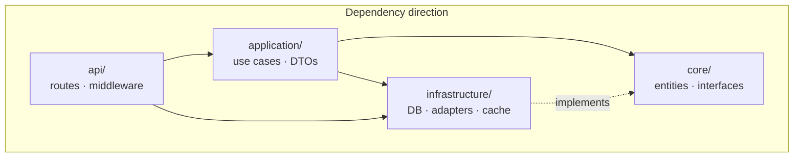
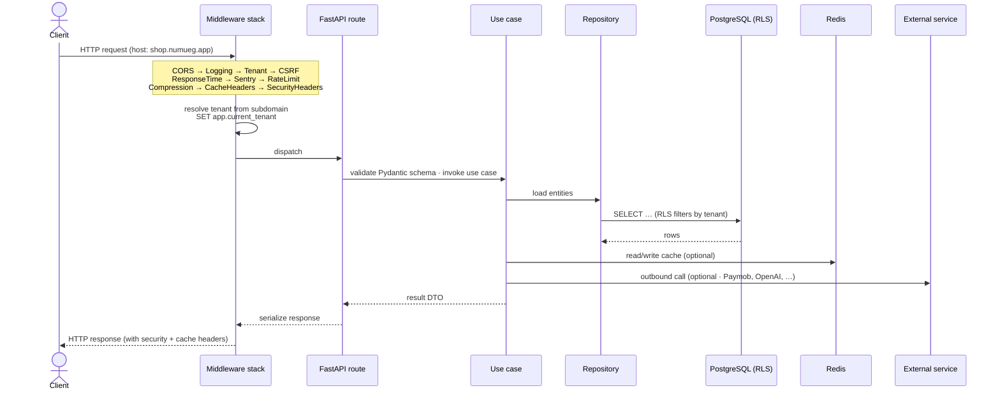
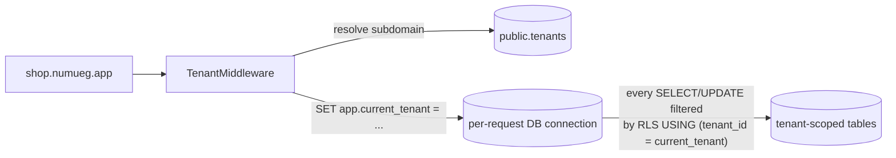
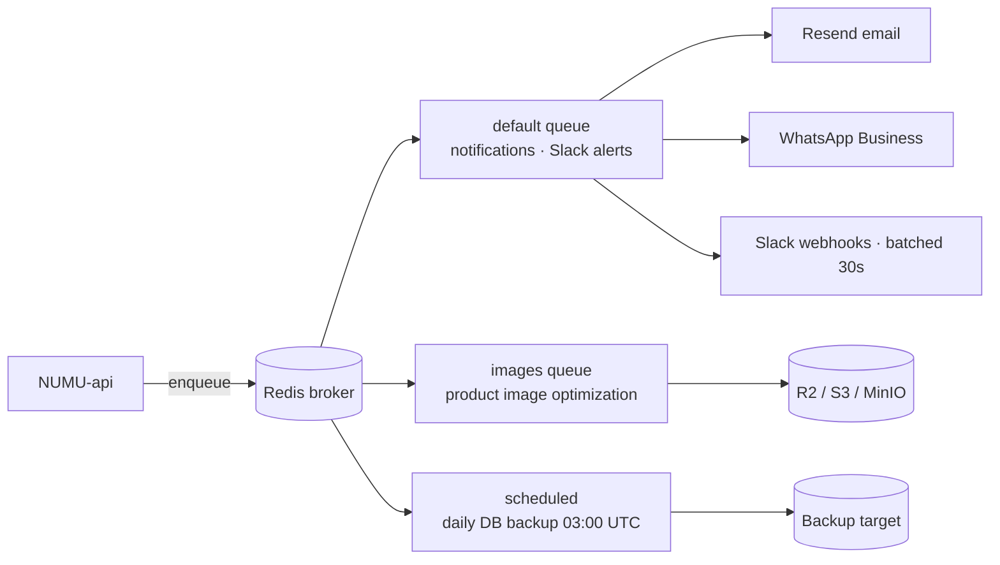

# NUMU API

The core backend for **NUMU** — a multi-tenant SaaS e-commerce platform purpose-built for the Egyptian and MENA market (*"Shopify for Egypt"*). Built with FastAPI and **Clean Architecture**, with PostgreSQL Row-Level Security for tenant isolation and a Celery worker fleet for background jobs.

Every NUMU frontend (merchant hub, admin backoffice, customer storefront, landing page) talks to this single API.

---

## Table of contents

- [System architecture](#system-architecture)
- [Clean Architecture layering](#clean-architecture-layering)
- [Request lifecycle](#request-lifecycle)
- [Multi-tenancy](#multi-tenancy)
- [Tech stack](#tech-stack)
- [Quick start](#quick-start)
- [API docs](#api-docs)
- [Configuration](#configuration)
- [External services](#external-services)
- [Background jobs](#background-jobs)
- [Project structure](#project-structure)
- [Testing](#testing)
- [Development tools](#development-tools)

---

## System architecture



---

## Clean Architecture layering

Strict, one-way dependencies — **never** reverse them.



| Layer | Responsibility | Allowed imports |
|-------|----------------|-----------------|
| `core/` | Pure domain — entities, value objects, exceptions, interfaces | (nothing internal) |
| `application/` | Use cases + DTOs | `core/` only |
| `infrastructure/` | DB models, repositories, external services, cache, Celery tasks | `core/` (implements interfaces) |
| `api/` | HTTP routes, middleware, FastAPI deps, Pydantic schemas | All inner layers via DI |

---

## Request lifecycle



---

## Multi-tenancy

Shared schema + **PostgreSQL Row-Level Security**. Every tenant-scoped model carries a `tenant_id` foreign key, and the tenant middleware sets `app.current_tenant` per-request so RLS policies filter automatically.



---

## Tech stack

| Layer | Choice |
|-------|--------|
| Language | Python 3.11+ |
| Framework | FastAPI (async) |
| ORM | SQLAlchemy 2.0 (async) |
| Validation | Pydantic v2 |
| Database | PostgreSQL 15+ (Row-Level Security) |
| Cache / broker | Redis 7+ |
| Background jobs | Celery |
| Migrations | Alembic |
| Auth | JWT RS256 (access 30m + refresh 7d) · CSRF double-submit |
| Logging | structlog (JSON in prod, console in dev) |
| Admin panel | SQLAdmin (session-cookie auth) |
| PDF | WeasyPrint + Jinja2 (Noto Sans Arabic) |
| Encryption | AES-256-GCM (merchant credentials at rest) |

---

## Quick start

**Prerequisites:** Python 3.11+, PostgreSQL 15+, Redis 7+.

```bash
# 1. Clone and install dependencies
git clone <repository-url>
cd NUMU-api
pip install -e ".[dev]"

# 2. Configure environment
cp .env.example .env

# 3. Start dependencies via Docker
docker compose -f docker/docker-compose.yml up -d db redis

# 4. Run migrations
alembic upgrade head

# 5. (optional) Seed sample data
python scripts/seed_data.py

# 6. Start the dev server
make dev   # or: uvicorn src.main:app --reload --port 8000
```

Full stack via Docker Compose:

```bash
docker compose -f docker/docker-compose.yml up --build
```

---

## API docs

Once running, the auto-generated docs live at:

| URL | UI |
|-----|-----|
| `http://localhost:8000/docs` | Swagger UI |
| `http://localhost:8000/redoc` | ReDoc |
| `http://localhost:8000/admin` | SQLAdmin web panel (session-cookie auth) |

Routes are grouped under `/api/v1/`:

| Prefix | Domain |
|--------|--------|
| `/auth/` | Register · login · refresh · logout · CSRF · 2FA · email verification · password reset |
| `/stores/` | Store CRUD (owner) |
| `/stores/{id}/products/` | Product catalog |
| `/stores/{id}/orders/` | Order processing |
| `/stores/{id}/customers/` | Customer management |
| `/stores/{id}/categories/` | Category CRUD |
| `/stores/{id}/coupons/` | Coupons & discounts |
| `/stores/{id}/invoices/` | ETA e-invoicing |
| `/stores/{id}/analytics/` | Reporting |
| `/stores/{id}/settings/` | Store config + theme customization |
| `/storefront/store/{id}/` | Public catalog · customer auth · checkout |
| `/storefront/me/` | Customer profile · addresses · cart · orders |
| `/admin/` | Super-admin: tenants, waitlist, feedback, dashboard |
| `/tenants/` | Tenant registration & subdomain check |
| `/public/` | Waitlist signup · landing-page config |
| `/webhooks/` | Paymob · Fawry · Bosta · WhatsApp |
| `/health` | Liveness probe |

---

## Configuration

| Variable | Description | Default |
|----------|-------------|---------|
| `DEBUG` | Enable debug mode | `false` |
| `DATABASE_URL` | PostgreSQL connection string | required |
| `REDIS_URL` | Redis connection string | required |
| `JWT_PRIVATE_KEY` | RSA private key (PEM) | required |
| `JWT_PUBLIC_KEY` | RSA public key (PEM) | required |
| `STRIPE_SECRET_KEY` | Stripe API key | optional |
| `RESEND_API_KEY` | Resend email API key | optional |
| `OPENAI_API_KEY` | OpenAI API key | optional |
| `R2_ACCESS_KEY_ID` | Cloudflare R2 access key | optional |
| `META_APP_ID` | Meta (Facebook / Instagram) App ID | optional |
| `META_APP_SECRET` | Meta App Secret | optional |
| `META_WEBHOOK_VERIFY_TOKEN` | Webhook verification token | optional |
| `META_GRAPH_API_VERSION` | Graph API version | `v21.0` |
| `META_LOGIN_CONFIG_ID` | Facebook Login Config ID | optional |
| `INBOX_REALTIME_ENABLED` | Enable WebSocket inbox | `true` |
| `NOMINATIM_URL` | Self-hosted Nominatim base URL | optional |
| `LOCATIONIQ_KEY` | LocationIQ key (used if Nominatim unset) | optional |

See `src/config/settings.py` for the complete list.

---

## External services

| Category | Services |
|----------|----------|
| **Payments** | Paymob (cards + mobile wallets) · Fawry · Stripe · Tap · Cash on Delivery |
| **Shipping** | Bosta (Egyptian courier) · Shippo |
| **Email** | Resend |
| **Messaging** | WhatsApp Business API |
| **Storage** | Cloudflare R2 / MinIO / AWS S3 |
| **AI** | OpenAI (product descriptions, Arabic + English) |
| **Tax** | Egyptian Tax Authority (ETA) e-invoicing |
| **Maps** | Self-hosted Nominatim *(or)* LocationIQ |
| **Monitoring** | Sentry · Slack (7 webhook channels, batched every 30s) |

### Self-hosted Nominatim

The storefront checkout location picker calls `/storefront/.../geocode/reverse`, which proxies to either a self-hosted [Nominatim](https://nominatim.org/) container or [LocationIQ](https://locationiq.com/) depending on env config.

```bash
docker compose --profile geocoding up nominatim
```

The first run downloads ~200 MB and imports the Egypt OSM extract (~5 GB on disk, ~30 min). Subsequent restarts come up in seconds. The container runs `UPDATE_MODE=continuous` against Geofabrik's daily Egypt diff feed — no Celery task or manual re-import required.

---

## Background jobs



---

## Project structure

<details>
<summary>Show tree</summary>

```text
NUMU-api/
├── alembic/                   # Database migrations
├── docker/                    # Docker configuration
├── docs/                      # Documentation
├── scripts/                   # Utility scripts (seed, ops, etc.)
├── src/
│   ├── api/
│   │   ├── dependencies/      # FastAPI Depends() factories
│   │   ├── middleware/        # CORS, logging, tenant, CSRF, etc.
│   │   ├── responses/         # Response envelopes
│   │   └── v1/
│   │       ├── routes/        # API endpoints grouped by domain
│   │       └── schemas/       # Pydantic request/response schemas
│   ├── application/
│   │   ├── dto/               # Data transfer objects
│   │   ├── services/          # Application services
│   │   └── use_cases/         # Business use cases
│   ├── config/                # Pydantic settings management
│   ├── core/
│   │   ├── entities/          # Domain entities
│   │   ├── exceptions/        # Domain exceptions
│   │   ├── interfaces/        # Repository + service interfaces
│   │   └── value_objects/     # Money, LocalizedString, etc.
│   └── infrastructure/
│       ├── cache/             # Redis cache
│       ├── database/          # SQLAlchemy setup + ORM models
│       ├── external_services/ # Paymob, Bosta, OpenAI, …
│       ├── messaging/         # Celery tasks
│       └── repositories/      # Repository implementations
└── tests/
    ├── unit/                  # Unit tests
    ├── integration/           # Integration tests (real DB / Redis)
    └── e2e/                   # End-to-end tests
```
</details>

---

## Testing

```bash
pytest                                    # full suite
pytest --cov=src --cov-report=html        # with coverage
pytest tests/unit/                        # unit only
pytest tests/integration/                 # integration only
pytest tests/e2e/                         # end-to-end only
```

---

## Development tools

```bash
ruff format src/ tests/    # format
ruff check src/ tests/     # lint
mypy src/                  # type check
make migrate-new           # generate a new Alembic migration
make migrate               # apply migrations
make seed                  # seed sample data
```

---

## License

MIT.
