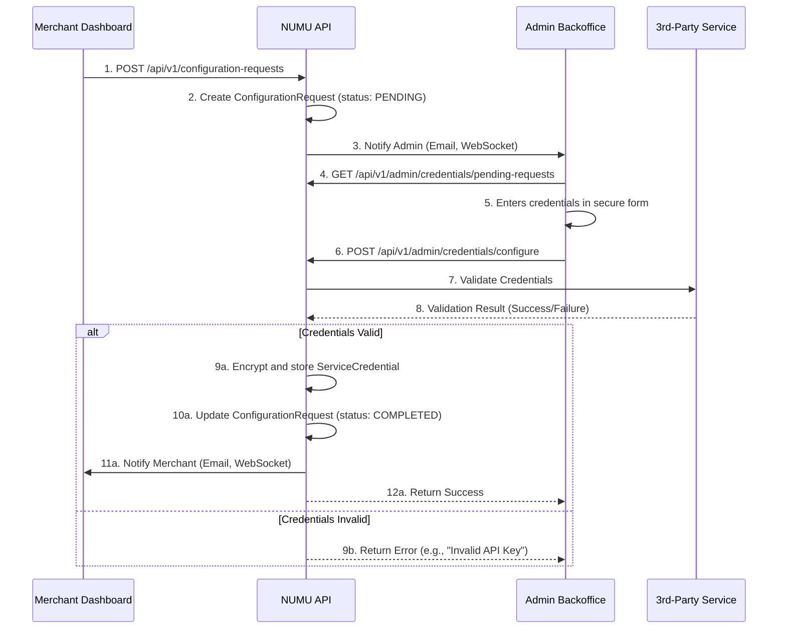

# Credential Configuration System

**Author**: Manus AI
**Date**: January 20, 2026
**Status**: Implemented

## 1. Overview

This document outlines the architecture and implementation of the **Secure Credential Configuration System** for the NUMU platform. This system provides a secure, auditable, and user-friendly workflow for merchants to request and administrators to configure sensitive credentials for third-party services like payment gateways, shipping carriers, and communication APIs.

### 1.1. The Problem: Secure Credential Management

E-commerce platforms require integration with numerous third-party services, each with its own set of sensitive API keys, secrets, and tokens. Managing these credentials securely is a critical challenge:

- **Frontend Exposure**: Storing or handling credentials in the frontend (browser) is a major security risk, exposing them to XSS attacks and direct theft.
- **Accidental Commits**: Developers can accidentally commit credentials to version control, creating a permanent security breach.
- **Lack of Auditability**: Without a proper system, there is no audit trail for who configured, updated, or revoked credentials.
- **Poor User Experience**: Requiring merchants to handle sensitive API keys directly is error-prone and intimidating.

### 1.2. The Solution: Admin-Mediated Configuration

To address these challenges, we have implemented an **admin-mediated configuration flow**. This architecture ensures that sensitive credentials **never touch the merchant's browser or the frontend codebase**. The entire lifecycle of a credential—from request to configuration to revocation—is handled through a secure backend and a dedicated admin interface.

**Key Principles**:

- **Zero Trust**: Assume the frontend is insecure. Credentials are never sent to or stored in the merchant dashboard.
- **Separation of Concerns**: Merchants *request* configuration; administrators *perform* configuration.
- **Encryption at Rest**: All credentials are encrypted using **AES-256-GCM** before being stored in the database.
- **Auditing**: Every action related to credentials is logged in an immutable audit trail.
- **Validation**: Credentials are validated with the provider before being stored to prevent misconfiguration.

## 2. System Architecture

The system is composed of several key components that work together to provide a seamless and secure workflow.

### 2.1. Data Models

Three primary database models support this system:

| Model | Description | Key Fields |
| :--- | :--- | :--- |
| `ConfigurationRequest` | Tracks a merchant's request for service configuration. | `tenant_id`, `service_type`, `service_name`, `status`, `priority` |
| `ServiceCredential` | Stores the encrypted credentials for a service. | `tenant_id`, `service_type`, `service_name`, `encrypted_credentials`, `is_active` |
| `CredentialAuditLog` | Records all actions related to credentials and requests. | `tenant_id`, `user_id`, `action`, `details` |

These models provide a robust foundation for tracking requests, storing credentials securely, and maintaining a complete audit history.

### 2.2. Workflow Diagram

### 2.3. Core Components

- **Secrets Manager**: A dedicated service responsible for encrypting and decrypting credentials using a master encryption key. This ensures that even if the database is compromised, the credentials remain secure.
- **Gateway Validators**: A collection of validators, one for each supported third-party service. These validators test credentials against the provider's API to ensure they are valid *before* they are stored.
- **Notification Service**: A multi-channel notification system that informs administrators of new requests and merchants of status updates via email and real-time WebSocket messages.
- **API Endpoints**: A set of secure, role-based API endpoints for merchants and administrators to interact with the system.

## 3. API Endpoints

Two sets of API endpoints are provided: one for merchants and one for administrators.

### 3.1. Merchant Endpoints

These endpoints are accessible to authenticated merchants.

| Endpoint | Method | Description |
| :--- | :--- | :--- |
| `/api/v1/configuration-requests` | `POST` | Create a new configuration request. |
| `/api/v1/configuration-requests` | `GET` | List all requests for the current merchant. |
| `/api/v1/configuration-requests/{id}` | `DELETE` | Cancel a pending request. |
| `/api/v1/configuration-requests/status/{type}/{name}` | `GET` | Get the configuration status of a specific service. |

### 3.2. Admin Endpoints

These endpoints are restricted to users with `admin` or `super_admin` roles.

| Endpoint | Method | Description |
| :--- | :--- | :--- |
| `/api/v1/admin/credentials/pending-requests` | `GET` | List all pending requests across all merchants. |
| `/api/v1/admin/credentials/requests/{id}` | `PATCH` | Update a request (assign, change status). |
| `/api/v1/admin/credentials/configure` | `POST` | **Securely configure credentials for a merchant.** |
| `/api/v1/admin/credentials/validate` | `POST` | Validate credentials without storing them. |
| `/api/v1/admin/credentials/{tenant}/{type}/{name}` | `DELETE` | Revoke/delete credentials for a service. |
| `/api/v1/admin/credentials/supported-services` | `GET` | Get a list of all supported services and their required fields. |

## 4. Security Considerations

Security is the cornerstone of this system. The following measures have been implemented:

- **Encryption**: All credentials are encrypted using **AES-256-GCM** with a unique initialization vector (IV) for each credential. The master encryption key is stored securely outside the main application database (e.g., in a dedicated secrets manager like AWS KMS or HashiCorp Vault).
- **Role-Based Access Control (RBAC)**: API endpoints are strictly protected. Only administrators can access endpoints that handle raw credentials.
- **Input Validation**: All incoming data is validated to prevent injection attacks and other vulnerabilities.
- **Immutable Audit Trail**: The `CredentialAuditLog` provides a tamper-evident record of all credential-related activities.
- **Credential Validation**: By validating credentials with the provider, we mitigate the risk of storing incorrect or malicious data.

## 5. Conclusion

The Secure Credential Configuration System provides a robust, secure, and scalable solution for managing third-party service credentials. By abstracting the complexity of credential management away from merchants and centralizing it within a secure, admin-controlled workflow, we significantly enhance the security posture of the NUMU platform and provide a superior user experience.

This system is a critical piece of infrastructure that enables NUMU to integrate with a wide range of services while maintaining the highest standards of security and compliance.
